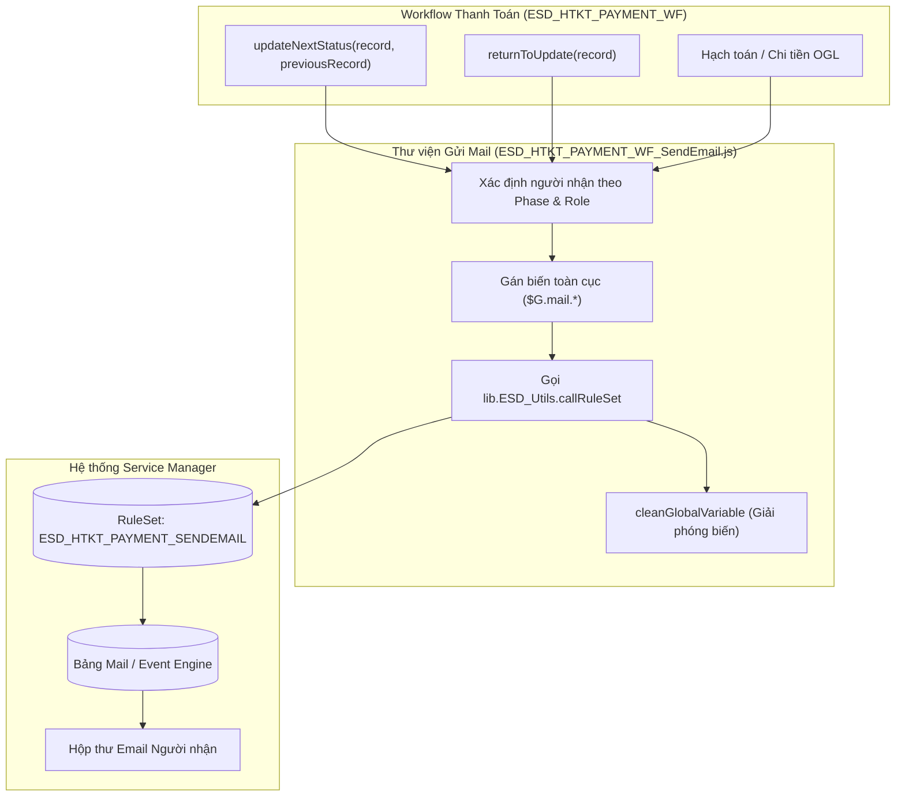
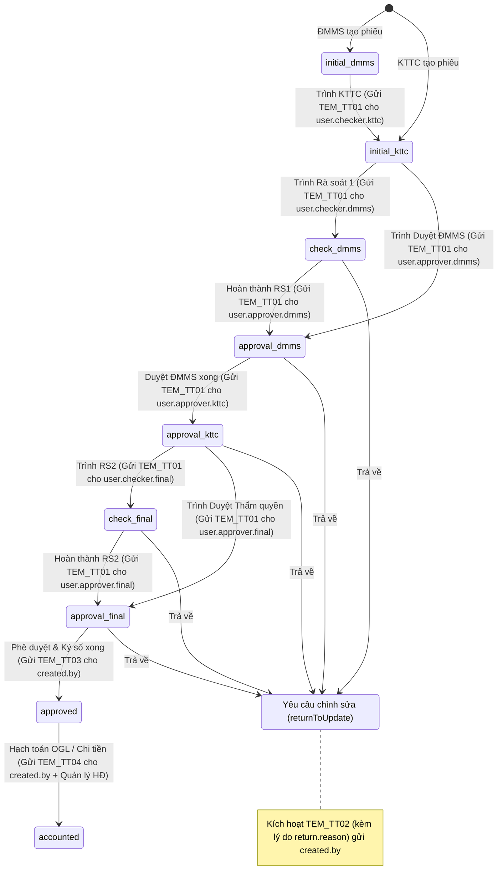

# KẾ HOẠCH TRIỂN KHAI HỆ THỐNG GỬI EMAIL - PHÂN HỆ THANH TOÁN (PAYMENT)

Tài liệu này đặc tả riêng **Kế hoạch & Thiết kế luồng Gửi Email tự động cho Phân hệ Thanh toán**, tích hợp trực tiếp với Workflow chính **`ESD_HTKT_PAYMENT_WF`** (`WF/PAYMENT_WF.js`) trên OpenText Service Manager.

---

## 1. MỤC TIÊU & PHẠM VI (SCOPE & OBJECTIVES)

* **Mục tiêu**: Tự động gửi thông báo qua email cho từng vai trò tham gia chu trình thanh toán (Cán bộ ĐMMS, Cán bộ KTTC, Người rà soát, Người phê duyệt các cấp, Kế toán thực chi, Người theo dõi HĐ) tại từng điểm chuyển Phase trong workflow.
* **Phạm vi áp dụng**: 
  - Phiếu Đề nghị thanh toán (`esdHTKTpayment`).
  - Toàn bộ chu trình chuyển Phase trong **`ESD_HTKT_PAYMENT_WF`**:
    - `initial_dmms` $\rightarrow$ `initial_kttc` $\rightarrow$ `check_dmms` $\rightarrow$ `approval_dmms` $\rightarrow$ `approval_kttc` $\rightarrow$ `check_final` $\rightarrow$ `approval_final`.
    - Trả về chỉnh sửa (`returnToUpdate`) và Hủy phiếu (`cancelRequest`).
    - Hạch toán OGL thành công / Thực chi thành công và Cảnh báo hạn thanh toán.

---

## 2. KIẾN TRÚC KỸ THUẬT (SM TECHNICAL ARCHITECTURE)

Hệ thống kết nối trực tiếp giữa **Workflow Controller (`ESD_HTKT_PAYMENT_WF`)** và **Thư viện gửi Email (`ESD_HTKT_PAYMENT_WF_SendEmail.js`)**:



### Các biến toàn cục (Global Variables):
* **`$G.mail.receiver`**: Mảng chứa email người nhận (`[contact.email]`).
* **`$G.mail.receiver.name`**: Họ và tên đầy đủ của người nhận (`contact.full.name`).
* **`$G.mail.tem`**: Mã template email tương ứng (`TEM_TT01` đến `TEM_TT05`).

---

## 3. MA TRẬN TEMPLATE EMAIL THEO PHASE WORKFLOW THỰC TẾ

Dựa trên cấu trúc phân quyền và các trường người duyệt trong `ESD_HTKT_PAYMENT_WF`:

| Mã Template | Tên nghiệp vụ | Phase / Sự kiện kích hoạt | Người nhận (Field trên record `esdHTKTpayment`) |
| :--- | :--- | :--- | :--- |
| **`TEM_TT01`** | **Yêu cầu xử lý / Rà soát / Phê duyệt** | - Rời `initial_dmms`: Chuyển sang KTTC xử lý<br>- Rời `initial_kttc`: Chuyển Rà soát / Duyệt ĐMMS<br>- Rời `check_dmms`: Chuyển Duyệt ĐMMS<br>- Rời `approval_dmms`: Chuyển Duyệt KTTC<br>- Rời `approval_kttc`: Chuyển Rà soát / Duyệt Cấp thẩm quyền<br>- Rời `check_final`: Chuyển Duyệt Cấp thẩm quyền | - `user.checker.kttc`<br>- `user.checker.dmms` (nếu `require.check.level1`)<br>- `user.approver.dmms`<br>- `user.approver.kttc`<br>- `user.checker.final` (nếu `require.check.level2`)<br>- `user.approver.final` |
| **`TEM_TT02`** | **Yêu cầu chỉnh sửa (Trả về)** | Khi gọi `returnToUpdate` | Người tạo phiếu (`created.by`) + Cán bộ KTTC xử lý (`user.checker.kttc`). Đính kèm `return.reason`. |
| **`TEM_TT03`** | **Phê duyệt thành công / Ký số hoàn tất** | Khi `approval_final` thành công (Status: `approved`) | Người tạo phiếu (`created.by`) + Cán bộ KTTC (`user.checker.kttc`) |
| **`TEM_TT04`** | **Hoàn tất hạch toán / Chi tiền** | Khi trạng thái chuyển sang `accounted` (Đã hạch toán OGL / Chi tiền) | Người tạo phiếu (`created.by`) + Người theo dõi HĐ (`executor.id` từ `esdHDcontract`) |
| **`TEM_TT05`** | **Cảnh báo hạn thanh toán** | Batch Job quét định kỳ các đợt thanh toán đến hạn | Người theo dõi HĐ + Cán bộ đầu mối thanh toán |

---

## 4. SƠ ĐỒ CHUYỂN PHASE & TRIGGER GỬI EMAIL TRONG `ESD_HTKT_PAYMENT_WF`



---

## 5. THIẾT KẾ MÃ NGUỒN (SOURCE CODE SCAFFOLD)

### 5.1. Thư viện gửi email: `ESD_HTKT_PAYMENT_WF_SendEmail.js`

```javascript
var callRuleSet = lib.ESD_Utils.callRuleSet;
var getCommonName = lib.ESD_Utils.getCommonName;

var emailList = {
    "YeuCauPheDuyet": "TEM_TT01",
    "YeuCauChinhSua": "TEM_TT02",
    "PheDuyet":       "TEM_TT03",
    "HoanThanhChi":   "TEM_TT04",
    "CanhBaoHanTT":   "TEM_TT05"
};

function getEmailList() {
    return emailList;
}

function cleanGlobalVariable() {
    vars["$G.mail.receiver"] = null;
    vars["$G.mail.receiver.name"] = null;
    vars["$G.mail.tem"] = null;
}

function sendMailPayment(record, user, template) {
    if (!record || !user || !user.email) return false;
    try {
        vars["$G.mail.receiver"] = [user.email];
        vars["$G.mail.receiver.name"] = user["full.name"] || user.fullName || "";
        vars["$G.mail.tem"] = template;

        callRuleSet(record, "ESD_HTKT_PAYMENT_SENDEMAIL");
        return true;
    } catch (e) {
        print("[ESD_HTKT_PAYMENT_WF_SendEmail] Error: " + e);
        return false;
    } finally {
        cleanGlobalVariable();
    }
}

// 1. Gửi cho người tạo hồ sơ (Owner)
function sendMailToOwner(record, template) {
    var createdBy = record["created.by"] || record.created_by;
    var userOwner = lib.ESD_Utils.getOneRecord("contacts", 'contact.name="' + createdBy + '"', ["email", "full.name"]);
    if (userOwner) return sendMailPayment(record, userOwner, template);
    return false;
}

// 2. Gửi cho người duyệt / tiếp nhận theo Phase
function sendMailToPhaseApprover(record, approverContactId) {
    if (!approverContactId) return false;
    var approver = lib.ESD_Utils.getOneRecord("contacts", 'contact.name="' + approverContactId + '"', ["email", "full.name"]);
    if (approver) return sendMailPayment(record, approver, emailList.YeuCauPheDuyet);
    return false;
}

// 3. Xử lý gửi mail khi Trả về chỉnh sửa (returnToUpdate)
function sendMailOnReturn(record) {
    return sendMailToOwner(record, emailList.YeuCauChinhSua);
}

// 4. Xử lý gửi mail khi Phê duyệt hoàn tất (approval_final)
function sendMailOnApproved(record) {
    return sendMailToOwner(record, emailList.PheDuyet);
}

// 5. Xử lý gửi mail khi Hạch toán thành công (accounted)
function sendMailOnAccounted(record) {
    sendMailToOwner(record, emailList.HoanThanhChi);
    if (record.contract_id) {
        var contractExecutor = getCommonName("esdHDcontract", 'id="' + record.contract_id + '"', "executor.id");
        if (contractExecutor) {
            var executorContact = lib.ESD_Utils.getOneRecord("contacts", 'contact.name="' + contractExecutor + '"', ["email", "full.name"]);
            if (executorContact) sendMailPayment(record, executorContact, emailList.HoanThanhChi);
        }
    }
}
```

### 5.2. Điểm móc nối (Hooks) trong `ESD_HTKT_PAYMENT_WF`

1. **Trong hàm `updateNextStatus(record, previousRecord)`**:
   - Khi chuyển sang phase tiếp theo $\rightarrow$ gọi `sendMailToPhaseApprover(record, targetUser)`.
   - Khi phase đạt `approval_final` (status `approved`) $\rightarrow$ gọi `sendMailOnApproved(record)`.
2. **Trong hàm `returnToUpdate(record)`**:
   - Sau khi cập nhật trạng thái `request_edit` $\rightarrow$ gọi `sendMailOnReturn(record)`.
3. **Khi đồng bộ trạng thái hạch toán OGL (`accounted`)**:
   - Gọi `sendMailOnAccounted(record)`.

---

## 6. KẾ HOẠCH TRIỂN KHAI & KIỂM THỬ (TEST PLAN)

### Bước 1: Cấu hình SM Backend
* RuleSet: `ESD_HTKT_PAYMENT_SENDEMAIL`.
* 5 Email Template (`TEM_TT01` - `TEM_TT05`) với các placeholder `{id}`, `{description}`, `{total.amount.paid}`, `{return.reason}`, `{link}`.

### Bước 2: Kịch bản kiểm thử (Test Cases)
1. **TC-01 (ĐMMS -> KTTC)**: ĐMMS trình phiếu $\rightarrow$ Kiểm tra mail `TEM_TT01` đến `user.checker.kttc`.
2. **TC-02 (KTTC -> Cấp duyệt ĐMMS)**: KTTC hoàn tất xử lý $\rightarrow$ Mail `TEM_TT01` đến `user.checker.dmms` / `user.approver.dmms`.
3. **TC-03 (Duyệt ĐMMS -> Duyệt KTTC -> Duyệt Thẩm quyền)**: Từng cấp duyệt thành công $\rightarrow$ Mail `TEM_TT01` đến người duyệt cấp tiếp theo.
4. **TC-04 (Trả về - returnToUpdate)**: Cấp bất kỳ trả về kèm lý do $\rightarrow$ Mail `TEM_TT02` đến `created.by` hiển thị đúng lý do trả về.
5. **TC-05 (Duyệt cuối & Ký số xong)**: Cấp thẩm quyền duyệt $\rightarrow$ Mail `TEM_TT03` báo về `created.by`.
6. **TC-06 (Hạch toán xong)**: Cập nhật `accounted` $\rightarrow$ Mail `TEM_TT04` báo về `created.by` và người quản lý hợp đồng.
