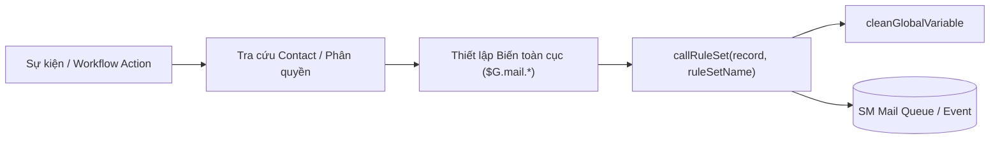

# TÀI LIỆU HỆ THỐNG GỬI EMAIL TỰ ĐỘNG (SERVICE MANAGER JS)

Tài liệu này tổng hợp chi tiết toàn bộ cơ chế, danh mục kịch bản, bảng mã Template email hiện có trong hệ thống và kế hoạch thiết kế cho phân hệ **Thanh toán (Payment)**.

---

## 1. CƠ CHẾ VẬN HÀNH CHUNG (CORE ARCHITECTURE)

Hệ thống gửi email trong Service Manager sử dụng cơ chế kích hoạt **RuleSet Engine**:



### Các biến toàn cục (Global Variables) sử dụng:
* **`$G.mail.receiver`**: Mảng danh sách địa chỉ email người nhận (ví dụ: `["user@example.com"]`).
* **`$G.mail.receiver.name`**: Tên đầy đủ của người nhận (Full name).
* **`$G.mail.tem`**: Mã Template email (dùng cho các RuleSet dùng chung nhiều template).

---

## 2. CHI TIẾT CÁC PHÂN HỆ ĐÃ TRIỂN KHAI

### 2.1. Phân hệ Yêu cầu báo giá / Hồ sơ yêu cầu (YCBG/HSYC)
* **File kịch bản**:
  - `ESD_MS_YCBG_ACTION_WF.js`: Điều phối workflow action.
  - `ESD_MS_YCBG_ACTION_WF_SendEmail.js`: Xử lý gửi email.
* **RuleSet**: `ESD_MS_YCBG_SENDEMAIL`

#### Danh mục Template:
| Mã Template | Hằng số | Nghiệp vụ | Người nhận |
| :--- | :--- | :--- | :--- |
| **`TEM014`** | `YeuCauXacNhan` | Yêu cầu Tổ chuyên gia mua sắm xác nhận | Tổ chuyên gia MS (bảng `esdMSkmsApproval`) |
| **`TEM015`** | `YeuCauPheDuyet` | Yêu cầu Đại diện Chủ đầu tư phê duyệt | Đại diện Chủ đầu tư (`esdMSkmsApproval`) |
| **`TEM016`** | `XacNhan` | Thông báo hồ sơ YCBG/HSYC đã được xác nhận | Người tạo hồ sơ (`created.by`) |
| **`TEM017`** | `YeuCauChinhSua` | Thông báo yêu cầu chỉnh sửa hồ sơ | Người tạo hồ sơ (`created.by`) |
| **`TEM018`** | `PheDuyet` | Thông báo hồ sơ YCBG/HSYC đã được phê duyệt | Người tạo hồ sơ (`created.by`) |

---

### 2.2. Phân hệ Quản lý Hợp đồng & Triển khai / Nghiệm thu / Nhập kho
* **File kịch bản**:
  - `ESD_HD_ACTION_WF_SEND_EMAIL.js`
  - `ESD_HD_CONTRACT_SENDEMAIL.js`

#### Danh mục Template:
| Mã Template | Tên hàm | Nội dung gửi | Người nhận |
| :--- | :--- | :--- | :--- |
| **`TEMP01`** | `sendEmailAlertExpireHD` | Cảnh báo sắp hết hạn HĐ/Khoản mua sắm trực tiếp | Người theo dõi thực hiện (`executor_id`) |
| **`TEMP02`** | `sendEmailAlertExpireGuarantee` | Cảnh báo sắp hết hạn Bảo lãnh/Bảo hành/Bảo đảm | Người tạo hợp đồng (`created_by`) |
| **`TEMP03`** | `sendEmailAlertNDTH` | Cảnh báo thời gian thực hiện NDTH | Người thực hiện & Người tạo |
| **`TEMP04`** | `sendEmailAlertExpireNHTH` | Cảnh báo sắp đến hạn thực hiện nội dung | Người thực hiện & Người tạo |
| **`TEMP05`** | `sendEmailYCNhapKho` | Yêu cầu nhập kho | Cán bộ quyền kho cấp 1 (`unit_lv1`) |
| **`TEMP06`** | `sendEmailYCNhapTS` | Yêu cầu nhập tài sản | Cán bộ quyền tài sản cấp 1 (`unit_lv1`) |
| **`TEMP07`** | `sendEmailXNNhapKho` | Xác nhận nhập kho | Người thực hiện phiếu & Người theo dõi HĐ |
| **`TEMP08`** | `sendEmailXNNhapTS` | Xác nhận nhập tài sản | Người thực hiện phiếu & Người theo dõi HĐ |
| **`TEMP09`** | `sendMailSendRequestBBNTCLKT` | Gửi yêu cầu xác nhận BBNT CLKT | Cán bộ quyền nghiệm thu cấp 2 (`unit_lv2`) |
| **`TEMP10`** | `sendEmailTuChoiNhapTaiSan` | Từ chối nhập tài sản | Người thực hiện phiếu |
| **`TEMP11`** | `sendEmailTuChoiNhapKho` | Từ chối nhập kho | Người thực hiện phiếu |
| **`TEMP12`** | `sendEmailBBNTCLKT_XN` | Lãnh đạo xác nhận BBNT CLKT | Người thực hiện lập biên bản |
| **`TEMP13`** | `sendEmailBBNTCLKT_YCCS` | Yêu cầu chỉnh sửa BBNT CLKT | Người thực hiện lập biên bản |
| **`TEMP14`** | `sendEmailBBNTBanGiao_YCXN` | Yêu cầu xác nhận BBNT bàn giao | Cán bộ quyền nghiệm thu cấp 2 (`unit_lv2`) |
| **`TEMP15`** | `sendEmailBBNTBanGiao_XN` | Lãnh đạo xác nhận BBNT bàn giao | Người thực hiện |
| **`TEMP16`** | `sendEmailBBNTBanGiao_YCCS` | Yêu cầu chỉnh sửa BBNT bàn giao | Người thực hiện |
| **`TEMP17`** | `sendEmailTrienKhai_HoanThanh` | Thông báo hoàn thành triển khai | Người tạo yêu cầu |
| **`TEMP18`** | `sendEmailTrienKhai_PheDuyetDieuChinh` | Yêu cầu phê duyệt điều chỉnh | Người thực hiện |
| **`TEMP19`** | `sendEmailTrienKhai_YeuCauChinhSua` | Yêu cầu chỉnh sửa yêu cầu triển khai | Người tạo phiếu yêu cầu triển khai cha |
| **`TEMP20`** | `sendEmailTrienKhai_YeuCauCNDV` | Yêu cầu triển khai chi nhánh/đơn vị | Danh sách `userIds` |
| **`TEMP27`** | `sendEmailChinhSuaTHTK` | Yêu cầu chỉnh sửa phiếu THTK | Người thực hiện |
| **`TEMP28`** | `sendEmailTscXacNhanTrienKhai` | TSC xác nhận triển khai | Người thực hiện |
| **`TEMP29`** | `sendEmailAlertTHTK` | Cảnh báo thời gian thực hiện THTK | Danh sách `userIds` |
| **`TEMP31`** | `sendEmailEditTHTKTSC` | Yêu cầu chỉnh sửa THTK TSC | Người thực hiện |

---

## 3. THIẾT KẾ & KẾ HOẠCH CHO PHÂN HỆ THANH TOÁN (PAYMENT)

### 3.1. File kịch bản khởi tạo
* **`ESD_HTKT_PAYMENT_ACTION_WF_SendEmail.js`**
* **RuleSet dự kiến**: `ESD_HTKT_PAYMENT_SENDEMAIL`

### 3.2. Bảng mã Template dự kiến
| Mã Template | Hằng số | Nghiệp vụ | Người nhận |
| :--- | :--- | :--- | :--- |
| **`TEM_TT01`** | `YeuCauPheDuyet` | Yêu cầu xác nhận / phê duyệt hồ sơ thanh toán | Người duyệt kế tiếp / Cấp duyệt theo ma trận |
| **`TEM_TT02`** | `YeuCauChinhSua` | Thông báo hồ sơ thanh toán bị từ chối / cần sửa | Người lập hồ sơ (`created.by`) |
| **`TEM_TT03`** | `PheDuyet` | Thông báo hồ sơ thanh toán đã duyệt / ký số xong | Người lập hồ sơ (`created.by`) |
| **`TEM_TT04`** | `HoanThanhChi` | Thông báo đã hạch toán / chi tiền thành công | Người lập hồ sơ + Người theo dõi HĐ |
| **`TEM_TT05`** | `CanhBaoHanTT` | Cảnh báo sắp đến hạn thanh toán đợt tiếp theo | Người theo dõi thực hiện HĐ / Kế toán |

### 3.3. Hướng dẫn tích hợp vào Workflow Thanh toán
Khi hoàn thiện FSD/BRD, tại file điều phối workflow thanh toán (ví dụ `ESD_HTKT_PAYMENT_ACTION_WF.js`), chỉ cần gọi các hàm từ thư viện `ESD_HTKT_PAYMENT_ACTION_WF_SendEmail`:

```javascript
var sendMailPaymentLib = lib.ESD_HTKT_PAYMENT_ACTION_WF_SendEmail;

function executePaymentWorkflowAction(record, actionCode, oldrecord) {
    switch (actionCode) {
        case "SUBMIT_APPROVE":
            // Gửi email yêu cầu phê duyệt
            sendMailPaymentLib.sendMailToApprover(record);
            break;

        case "REJECT_EDIT":
            // Gửi email yêu cầu chỉnh sửa kèm lý do
            sendMailPaymentLib.sendMailYeuCauChinhSua(record);
            break;

        case "APPROVE_SUCCESS":
            // Gửi email thông báo đã phê duyệt
            sendMailPaymentLib.sendMailPheDuyet(record);
            break;

        case "POST_SUCCESS":
            // Gửi email thông báo hoàn thành chi tiền
            sendMailPaymentLib.sendMailHoanThanhChiTien(record);
            break;
    }
}
```
